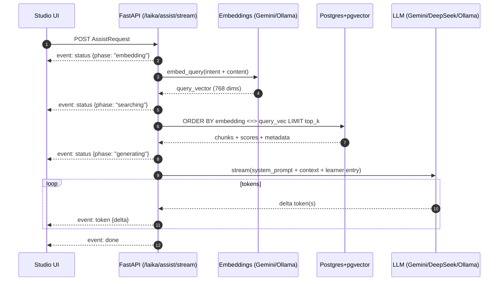

# LAIKA — RAG AI Mentor

LAIKA is the Studio AI mentor: RAG over a knowledge corpus + multi-provider LLM (Gemini, DeepSeek, or host Ollama). **Persona:** gender-neutral mentor — polite Thai without gendered particles (no ค่ะ/ครับ). Responses use **Markdown** (headings, lists, bold).

**API contract:** [api.md](api.md#LAIKA) · **Docker / env:** [../../docs/docker-dev.md](../../docs/docker-dev.md)

## Architecture

```
Learner → Studio UI → POST /laika/assist/stream (SSE)
                         ↓
                    Embed query (LAIKA_EMBEDDING_PROVIDER)
                         ↓
                    pgvector similarity search
                         ↓
                    LLM with context (LAIKA_LLM_PROVIDER)
                         ↓
                    response + sources[] (from chunk metadata)
```

## Charts (Mermaid)

> หมายเหตุ: แผนภาพด้านล่างใช้ Mermaid (render ได้ใน GitHub / หลาย Markdown viewers)

### High-level pipeline

```mermaid
flowchart TD
  U[Learner] --> F[Studio UI]
  F -->|POST /laika/assist/stream| API[FastAPI: /laika]
  API -->|status: embedding| E[Embeddings provider\nLAIKA_EMBEDDING_PROVIDER]
  E --> V[(query vector)]
  V -->|pgvector <=>| DB[(PostgreSQL + pgvector\nknowledge_chunks.embedding)]
  DB --> C[Retrieved chunks\n(content + metadata)]
  C -->|format_context| P[Prompt builder\n(system + human)]
  P -->|LLM stream| L[LLM provider\nLAIKA_LLM_PROVIDER]
  L -->|event: token (delta)| F
```

### `/laika/assist/stream` sequence (SSE)



### Ingest → `knowledge_chunks` (offline pipeline)

```mermaid
flowchart LR
  UP[Backoffice upload\n.md / .txt / .pdf] --> DB[(knowledge_sources)]
  DB --> PARSE[Parse file bytes]
  PARSE --> CHUNK[Chunking\n(split into passages)]
  CHUNK --> EMB[Embed each chunk\n(768-d vector)]
  EMB --> UPSERT[(knowledge_chunks)]
  UPSERT --> IDX[pgvector index\n(for similarity search)]
```

## Provider matrix

| `LAIKA_LLM_PROVIDER` | Client | Default model | Required env |
|----------------------|--------|---------------|--------------|
| `gemini` (default) | Google Gemini | `gemini-2.0-flash` | `GEMINI_API_KEY` |
| `deepseek` | DeepSeek (OpenAI-compatible) | `deepseek-chat` | `DEEPSEEK_API_KEY` |
| `ollama` | Host Ollama | `qwen2.5:7b-instruct` | `OLLAMA_BASE_URL` |

| `LAIKA_EMBEDDING_PROVIDER` | Client | Default model | Required env |
|-----------------------------|--------|---------------|--------------|
| `gemini` (default) | Google | `text-embedding-004` | `GEMINI_API_KEY` |
| `ollama` | Host Ollama | `nomic-embed-text` | `OLLAMA_BASE_URL` |

Changing embedding provider requires **full re-ingest**.

## Environment variables

```env
LAIKA_LLM_PROVIDER=gemini
LAIKA_EMBEDDING_PROVIDER=gemini
LAIKA_TOP_K=5
LAIKA_TIMEOUT_SECONDS=60
LAIKA_CONTEXT_WINDOW=0
LAIKA_MAX_HISTORY_TOKENS=8000
LAIKA_RESERVED_OUTPUT_TOKENS=1500

GEMINI_API_KEY=
GEMINI_MODEL=gemini-2.0-flash
GEMINI_EMBEDDING_MODEL=text-embedding-004

DEEPSEEK_API_KEY=
DEEPSEEK_MODEL=deepseek-chat

OLLAMA_BASE_URL=http://host.docker.internal:11434
OLLAMA_LLM_MODEL=qwen2.5:7b-instruct
OLLAMA_EMBED_MODEL=nomic-embed-text
OLLAMA_NUM_CTX=0
OLLAMA_KEEP_ALIVE=5m
```

### Example profiles

**Production (Render):** `gemini` / `gemini` + `GEMINI_API_KEY`

**Cheap cloud dev:** `deepseek` / `gemini` + `DEEPSEEK_API_KEY` + `GEMINI_API_KEY`

**Fully local (Windows host Ollama):**

```env
LAIKA_LLM_PROVIDER=ollama
LAIKA_EMBEDDING_PROVIDER=ollama
OLLAMA_BASE_URL=http://host.docker.internal:11434
```

1. Run Ollama desktop on Windows (`localhost:11434`)
2. `ollama pull qwen2.5:7b-instruct` and `ollama pull nomic-embed-text`
3. Backend in Docker uses `host.docker.internal` — **no Ollama container** in compose

## Knowledge corpus

```
backend/data/knowledge/
├── manifest.yaml       # ทะเบียนกลาง (id, module, stage, path, topic)
├── space/              # บทเรียน Space — แยกตาม stage (เช่น cubesat-101/)
├── arena/              # ภารกิจ Arena — แยกตาม mission
└── studio/             # ความรู้ภายนอกสำหรับ Studio (flat)
```

| Module | Folder | ใช้กับ |
|--------|--------|--------|
| `space` | `space/{stage}/` | บทเรียน, อธิบายจากสิ่งที่เรียน |
| `arena` | `arena/{stage}/` | mission brief, hints |
| `studio` | `studio/` (flat) | อาชีพ, TRL, case study ภายนอก |

เก็บใน DB หลัง sync/upload:
- `knowledge_sources` — ไฟล์ต้นฉบับ + `module`, `stage`, `manifest_id`
- `knowledge_chunks` — chunks + embeddings (pgvector)

รองรับไฟล์: `.md`, `.markdown`, `.txt`, `.pdf`

## Ingest

Ingest คือกระบวนการ “แปลงไฟล์ความรู้ → chunks → embeddings → เก็บลง `knowledge_chunks` (pgvector)”
เพื่อให้ LAIKA ค้นหา (similarity search) แล้วเอา chunk เหล่านั้นไปใส่ใน prompt ตอนตอบ

### Preconditions

- ต้อง migrate DB ให้มีตาราง + pgvector ก่อน: `alembic upgrade head`
- ต้องตั้ง embedding provider ให้พร้อม (เพราะ ingest ต้อง “embed”):
  - `LAIKA_EMBEDDING_PROVIDER=gemini` → ต้องมี `GEMINI_API_KEY`
  - `LAIKA_EMBEDDING_PROVIDER=ollama` → ต้องมี `OLLAMA_BASE_URL` (backend container ต้องยิงถึง host ได้)

### Backoffice UI (แนะนำ)

Route: **`/backoffice/knowledge`** (frontend) — ต้อง login และมี **`role: admin`**

Bootstrap admin ครั้งแรก (dev):

```env
ADMIN_EMAILS=you@example.com
```

อีเมลในรายการจะถูก promote เป็น `admin` ตอน register/login

- **Sync manifest** — อ่าน `manifest.yaml` + ไฟล์ใน git → DB → ingest
- อัปโหลด ad-hoc ผ่านหน้าเว็บ → เก็บใน DB → ingest ทันที
- Re-ingest / ลบเอกสาร

API:
- `POST /backoffice/knowledge/sync-manifest` — sync จาก manifest
- `POST /backoffice/knowledge/upload` — multipart upload + auto ingest
- `GET /backoffice/knowledge` — รายการเอกสาร + chunk counts
- `POST /backoffice/knowledge/ingest` — re-ingest
- `DELETE /backoffice/knowledge/sources/{id}` — ลบเอกสาร

### CLI

```bash
# Sync manifest → DB → ingest (แนะนำหลังแก้ md ใน git)
docker compose exec backend python -m scripts.sync_knowledge_manifest

# Re-ingest จาก DB เท่านั้น
docker compose exec backend python -m scripts.ingest_knowledge --source all
```

### What ingest does (ตาม `app/services/knowledge/ingest.py`)

#### 1) โหลดเอกสารจาก database

- อ่าน `knowledge_sources.file_data` (bytes ที่อัปโหลดผ่าน backoffice)
- metadata: `title`, `filename`, `source_type`, `language`, `topic`

#### 2) Parse ตามชนิดไฟล์

- ถ้า `pdf` ใช้ `PyPDFLoader` (ผ่าน temp file) → ได้ `Document[]` ทีละหน้า
- ถ้า `markdown`/`text` decode UTF-8 เป็นข้อความทั้งไฟล์

#### 3) Chunking (RecursiveCharacterTextSplitter)

ใช้ `RecursiveCharacterTextSplitter`:
- `chunk_size = 1000`
- `chunk_overlap = 150`

แล้วเติม metadata ให้ทุก chunk:
- `source_id`, `source_title`, `topic`, `language`
- `page`:
  - ถ้ามาจาก PDF จะติดมากับ page อยู่แล้ว
  - ถ้า manifest ระบุ `page` และ chunk ยังไม่มี page จะเอามาใส่

> แนวคิด: chunk overlap ช่วยให้คำอธิบาย/สมการ/นิยามที่อยู่ใกล้กันไม่ถูกตัดขาดตอน search

#### 4) Embedding (batch)

- สร้าง embeddings client จาก `LAIKA_EMBEDDING_PROVIDER` (ผ่าน `get_embeddings(settings)`)
- embed ด้วย `embed_documents()` แบบแบ่ง batch:
  - `batch_size = 32`

ผลลัพธ์คือ vector ต่อ chunk (คาดหวัง 768 dims) ซึ่งจะเก็บลง column:
- `knowledge_chunks.embedding` = `Vector(768)`

#### 5) Replace rows per source (delete then insert)

ภายใน transaction ต่อ source:
- `DELETE FROM knowledge_chunks WHERE source_id = <source.id>`
- จากนั้น insert chunk ใหม่ทั้งหมดของ source นั้น

ข้อดี: ง่ายและ deterministic (ไม่ต้องทำ diff/merge ราย chunk)
ข้อควรระวัง: ingest ระหว่างใช้งานจริงอาจทำให้ sources แกว่งชั่วคราวในช่วงที่ source นั้นถูกล้างและยังเขียนไม่ครบ

#### 6) Stored schema (สำคัญตอน debug)

ตาราง `knowledge_chunks` (ดู `app/models/knowledge_chunk.py`) เก็บ:
- `id` (UUID)
- `content` (Text)
- `embedding` (Vector(768))
- `embedding_provider` (string label ของ provider/model ณ ตอน ingest)
- `source_id`, `source_title`
- `page` (int | null)
- `topic` (nullable)
- `language`
- `created_at`

### When to re-run ingest

- เพิ่ม/แก้ไฟล์ใน `data/knowledge/` หรือแก้ `manifest.yaml`
- เปลี่ยน `LAIKA_EMBEDDING_PROVIDER` หรือเปลี่ยน embedding model
  - เพราะ vector space เปลี่ยน → similarity search เทียบกันไม่ได้

### Quick validation checklist

- `GET /laika/health` ต้อง `enabled: true` และ `embedding_provider` ถูกต้อง
- `knowledge_chunks` ต้องมี rows (ไม่งั้น `sources[]` จะว่าง)
- ถ้าใช้ Ollama embeddings: ใน backend container ต้องยิงถึง `OLLAMA_BASE_URL` ได้

## Intents

| Intent | Use |
|--------|-----|
| `summarize` | Organize a note |
| `explain` | Connect note to course material |
| `next-step` | Suggest Arena / lesson next steps |
| `analyze` | Feasibility of an idea |
| `innovation-path` | TRL / prototype roadmap |
| `more-ideas` | Related concept extensions |
| `career-path` | Related space careers |

## Prompt context (assist)

Each assist call builds a **human** prompt (see `app/services/rag/context_window.py`) with:

| Block | Source |
|-------|--------|
| Learner name | Auth session — `display_name`, else email local-part (`learner.py`) |
| Current date/time | `client_now` from client, else server clock (Asia/Bangkok) |
| Conversation continuity | Gap since last `created_at` in history (`session_time.py`) — welcome-back after ~3 days; active threads should not reopen with สวัสดี every turn |
| RAG context | Retrieved chunks |
| Learner progress | Optional `learning_context` |
| Space catalog digest | Short markdown from `space_catalog.format_catalog_digest()` (published + coming_soon) appended under platform context |
| Entry type + pinned entry | `entry_type`, `entry_content` |
| History | `messages[]` with optional `[timestamp] Learner/LAIKA:` lines |
| Current message | `content` |

**Space catalog recommend-by-id rules** (encoded in prompt helper + digest header):

1. Recommend **only** course ids that appear in the catalog digest — never invent courses
2. Prefer `status: published` (enterable today); may mention `coming_soon` as “กำลังจะมี” but do not deep-link as available now
3. Treat `later` as soft / optional unless the learner asks for that topic specifically
4. Lunar ≠ CubeSat-only — do not force every intent through `cubesat-for-beginner`
5. Folders are navigation only — never recommend a folder as a lesson
6. When a published course has `outline[]`, LAIKA may point to module ids inside that course; outline items are not separate tree leaves

### Space path mode (not Studio)

`POST /space/laika/path/stream` is a separate session: flowing Thai chat + a live course map (DAG, pan/zoom). RAG is off. The model may append a ```path JSON fence (`steps` plus optional `edges`); the API strips it from `token` events and emits sanitized `plan_delta` / `plan`. Recommend-by-id rules above still apply. Opening copy is shown in the UI; skip persists as `status: skipped` without calling the LLM.

Studio chat should not own the learning path. If asked, point the learner to Space.

System prompts (`prompts.py`) instruct gender-neutral mentor Thai, Markdown/LaTeX, and **natural greeting** — use the learner's name sparingly; do not greet on every reply.

Studio chat sends `messages` via `toLaikaHistory()` (`created_at` per node), plus `client_now` on each assist/stream call.

## Sources

`POST /laika/assist/stream` streams tokens via SSE (`event: token` / `event: done` with `sources[]`). Studio uses this endpoint only — there is no non-streaming `/laika/assist`.

Both always return `sources: []` in the final payload (may be empty). Entries are built from **retrieved chunk metadata**, deduplicated by `(source_id, page)` — not parsed from LLM text.

## Troubleshooting

| Issue | Check |
|-------|--------|
| `503` on `/laika/assist/stream` | `GET /laika/health` — `enabled: false`? Set API keys / Ollama URL |
| Empty sources | Run ingest; verify `knowledge_chunks` has rows |
| Ollama unreachable from Docker | Ollama running on host? `curl http://localhost:11434/api/tags` |
| Slow responses | Local Ollama on CPU; try `gemini` or `deepseek` for LLM |
| Rate limits (Gemini/DeepSeek) | Retry; reduce ingest batch size |

## Security

- API keys only in workspace `.env` / `backend/.env` / host env — never frontend
- `GOOGLE_CLIENT_ID` is shared with frontend (public); keep `GOOGLE_CLIENT_SECRET` on backend only
- Do not log user note/idea content
- Do not expose Ollama port `11434` publicly in production

## Code layout

```
app/services/rag/
├── providers/       # get_llm(), get_embeddings()
├── retriever.py     # pgvector search
├── chain.py         # RAG orchestration
├── context_window.py # prompt assembly, history trim, context usage
├── session_time.py  # timestamps, welcome-back hints
├── learner.py       # learner display name
└── prompts.py       # per-intent system prompts
```

Tests: `pytest tests/test_laika.py tests/test_laika_providers.py tests/test_laika_context.py`
